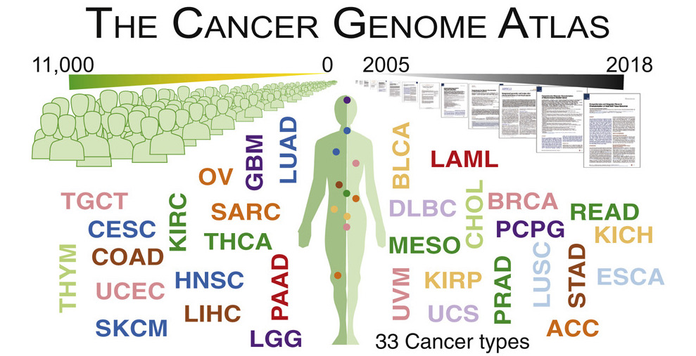

```{r setup, message=FALSE, echo=FALSE, warning=FALSE}
library(TCGAbiolinks)
library(tidyverse)
library(plotly)
library(survival)
library(survminer)
library(ggplot2)
library(ggpubr)
library(knitr)
```

```{r message=FALSE, echo=FALSE, warning=FALSE}
# Initialize code chunk options
opts_chunk$set(
  warning = FALSE,
  message = FALSE,
  eval=TRUE,
  echo = TRUE,
  cache = FALSE,
  fig.width = 7, 
  fig.align = 'center',
  fig.asp = 0.618,
  out.width = "700px")
```

```{css, echo = FALSE}
.code-r { /* Code block */
  font-size: 15px;
}

.code-r-small { /* Code block */
  font-size: 10px;
}
```


<h2><strong> Introduction </strong> </h2> 

<p> Breast cancer becomes the second leading cause of cancer death in women, so it is necessary for us to analyze the data of breast cancer patients and to discover the pathway and mechanism of breast cancer-related genes due to the high prevalence and mortality rate. In this project, since breast cancer can occur in women but rarely in men, I mainly focus on the age factor in female patients </p>


<h2><strong> Database </strong> </h2> 

<p> The Cancer Genome Atlas Program (TCGA) is a cancer genomics program that collects
 over 20,000 cancer tissue samples and matches them with normal samples spanning over 33
 cancer types (National Institute of Health). The data was sourced from TCGA with the TCGAbiolinks library using accession code “BRCA” </p>
 
```{r message=FALSE, echo=FALSE}

```


```{r load-data, message=FALSE, echo=FALSE, warning=FALSE, include=FALSE}
source("analysis.R")
```

<h2><strong> Survival Analysis </strong> </h2> 

<p> I first did survival analysis in female patients and examined the survival difference between young and old patients on two conditions: with tumor and without tumor </p>
```{r plot_01, message=FALSE, echo=FALSE, warning=FALSE}
#the ggtheme and legend arguments are for formatting. 
# Feel free to play around with the margins and legend placement
survplot_with_tumor = ggsurvplot(age_fit_with_tumor, 
                      risk.table=TRUE, 
                      risk.table.col="strata",
                      risk.table.title = FALSE,
                      legend = "right",
                      legend.title = c("Age"),
                      legend.labs = c("old (N=61)", "young (N=38)"),
                      title="Kaplan-Meier Curve for Breast Cancer Survival with tumor (N=99)",
                      risk.table.height=0.3,
                      ggtheme = theme_bw())

survival_obj_with_tumor <- plotly::ggplotly(survplot_with_tumor[[1]])

risk_obj_with_tumor <- plotly::ggplotly(survplot_with_tumor[[2]])

final_plotly_obj_with_tumor <- plotly::subplot(survival_obj_with_tumor, risk_obj_with_tumor , nrows = 2, shareX = TRUE, titleY = TRUE, heights=c(0.8, 0.2), margin = 0.07) %>%
  layout(title = 'Survival Analysis for Breast Cancer with tumor (N=99)')
 
```

```{r plot_02, message=FALSE, echo=FALSE, warning=FALSE}
survplot_tumor_free = ggsurvplot(age_fit_tumor_free, 
                                 risk.table=TRUE, 
                                 risk.table.col="strata", 
                                 legend = "right",
                                 legend.title = c("Age"),
                                 legend.labs = c("old (N=690)", "young (N=237)"),
                                 title="Survival Analysis for Breast Cancer without tumor (N=928)",
                                 risk.table.height=0.3,
                                 ggtheme = theme_bw())

survival_obj_tumor_free <- plotly::ggplotly(survplot_tumor_free[[1]])

risk_obj_tumor_free <- plotly::ggplotly(survplot_tumor_free[[2]])

final_plotly_obj_tumor_free <- plotly::subplot(survival_obj_tumor_free, risk_obj_tumor_free , nrows = 2, shareX = TRUE, titleY = TRUE, heights=c(0.8, 0.2), margin = 0.07) %>%
  layout(title = 'Survival Analysis for Breast Cancer without tumor (N=928)')

```

## {.tabset}

### Tab 1

```{r echo=FALSE}
final_plotly_obj_with_tumor
```

### Tab 2

```{r echo=FALSE}
final_plotly_obj_tumor_free
```

## {-}

<p> We can find that overall, female patients without tumor have higher survival probability than female patients with tumor. If we examine closer, we can see that there is no significant survival difference between young and old patients when they have tumor. However, in the tumor-free group, old patients experience much lower survival probability than young patients </p> 

<h2><strong> Gene Mutation Analysis </strong> </h2> 

<p> This is the oncoplot graph shows the difference in gene's mutation rate between young and old patients </p>

```{r plot_03, message=FALSE, echo=FALSE, warning=FALSE, include=FALSE}
# The gene we choose is TP53 acts as a tumor suppressor
clinic_maf = maf_object@clinical.data
# Create the young_patients_ids vector
young_patients_ids = clinic_maf$Tumor_Sample_Barcode[clinic_maf$age_at_initial_pathologic_diagnosis < 50]

young_maf = subsetMaf(maf = maf_object,
                      tsb = young_patients_ids)

# 4. Repeat steps 2-3 to create an old_maf! Can you do it in one line?
old_patients_ids = clinic_maf$Tumor_Sample_Barcode[clinic_maf$age_at_initial_pathologic_diagnosis >= 50]
old_maf = subsetMaf(maf = maf_object,
                    tsb = old_patients_ids)
```

```{r message=FALSE, echo=FALSE}
coOncoplot(m1 = young_maf, 
           m2 = old_maf, 
           m1Name = "young", 
           m2Name = "old")
```

<p> Here, we close look at two genes: TP53 and GATA3, and see their mutation spots on protein structure. TP53 is the tumor suppressor and GATA3 is a regulator of mammary luminal cell differentiation, and an estrogen receptor (ER) associated marker in breast cancer </p>

<p> We use Lollipop plots to draw the mutation rate. Lollipop plots are simple and most effective way showing mutation spots on protein structure. Many oncogenes have a preferential sites which are mutated more often than any other locus. These spots are considered to be mutational hot-spots and lollipop plots can be used to display them along with rest of the mutations </p>

## {.tabset}

### Tab 1

```{r plot_04, message=FALSE, echo=FALSE, warning=FALSE,comment=FALSE}
lollipopPlot2(m1 = young_maf, 
              m2 = old_maf, 
              m1_name= "young_patients",
              m2_name = "old_patients",
              gene = "TP53")
```

### Tab 2

```{r plot_05, message=FALSE, echo=FALSE, warning=FALSE, comment=FALSE}
lollipopPlot2(m1 = young_maf, 
              m2 = old_maf, 
              m1_name= "young_patients",
              m2_name = "old_patients",
              gene = "GATA3")
```

## {-}

<p> We find that the mutation spots for TP53 spread across the whole protein, and the mutation varies. However, the mutation spots for GATA3 concentrate on one side of the protein with more frame_shift_Ins mutation </p>

<h2><strong> Implication </strong> </h2> 

<p> In many cancer studies, the main outcome under assessment is the time to an event of interest. If the event occurred in all individuals, many methods of analysis would be applicable. However, it is usual that at the end of follow-up some of the individuals have not had the event of interest, and thus their true time to event is unknown. Further, survival data are rarely Normally distributed, but are skewed and comprise typically of many early events and relatively few late ones. It is these features of the data that make the special methods called survival analysis necessary </p>

<p> The mutation spots tell us how the mutation locates on the protein, and we could find that for each gene, the mutation type and the mutation distribution are different. Therefore, the lollipop plots help us to further examine the mechanism of each gene mutation and possibly will find the precise treatment for those genes </p>